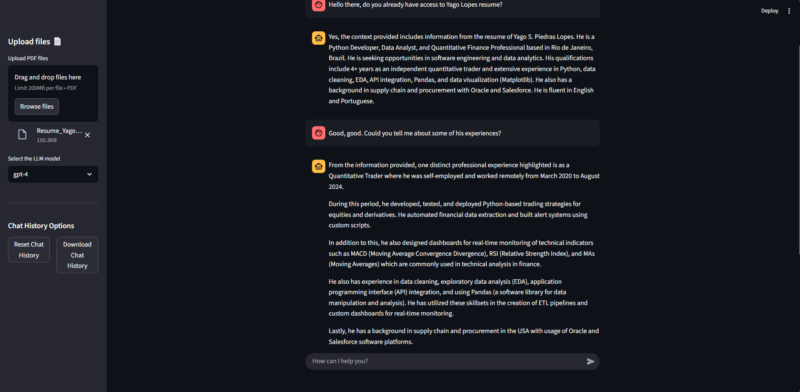

# Chat RAG 📄🤖

A **Streamlit** app to interact with your PDF documents using RAG (Retrieval-Augmented Generation) techniques and OpenAI LLMs.

---

## 🚀 Demo

https://github.com/yagosamu/chat_rag/chat_rag_demo.mp4  
<sup>↑ Click to watch a short video demo of the app in action (upload PDFs, ask questions, download chat history, and more!)</sup>

---

## ✨ Features

- **Upload multiple PDFs** and ask questions in natural language
- **Semantic search** with vector storage (ChromaDB)
- **Choose your LLM model** (gpt-3.5-turbo, gpt-4, etc)
- Intuitive UI with persistent chat history and Markdown answers
- **Download your chat history** as `.txt`, `.md`, or `.pdf`
- **Reset/Clear chat history** with one click
- Discreet footer with author credit
- Ready for local or cloud deployment

---

## 🛠️ How it works

1. **Upload**: Your PDF is split into chunks and vectorized using OpenAI embeddings.
2. **Storage**: Vectors are stored in ChromaDB for fast, semantic retrieval.
3. **Chat**: Relevant chunks are retrieved and sent to the LLM for contextual, accurate answers.

---

## 🏁 Getting Started

1. **Clone the repository:**
   ```bash
   git clone https://github.com/yagosamu/chat_rag.git
   cd chat_rag
   ```

2. **Install dependencies:**
   ```bash
   pip install -r requirements.txt
   ```

3. **Configure your OpenAI API key:**
   - Create a `.env` file in the root directory with:
     ```
     OPENAI_API_KEY=your_openai_key_here
     ```

4. **(Optional, for PDF download) Install:**
   ```bash
   pip install fpdf
   ```

5. **Run the app:**
   ```bash
   streamlit run app.py
   ```

---

## 💡 Usage

- Upload one or more PDF files using the sidebar
- Choose your preferred language model
- Send questions via the chat input
- Download or clear the chat history anytime

---

## 📦 Stack

- [Streamlit](https://streamlit.io/)
- [LangChain](https://www.langchain.com/)
- [ChromaDB](https://www.trychroma.com/)
- [OpenAI API](https://platform.openai.com/)
- [FPDF](https://pyfpdf.github.io/) (optional for PDF export)

---

## 👤 Author

Built by **Yago S. Piedras Lopes**  
[](https://www.linkedin.com/in/yagolopes/)

